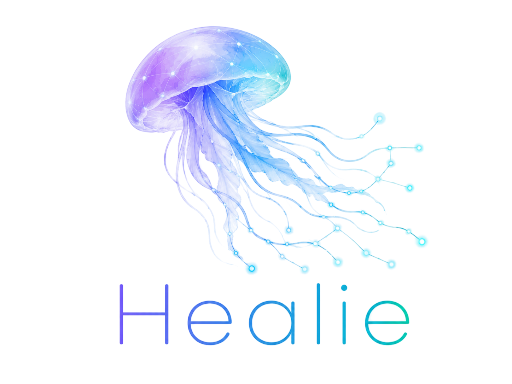

# HEALIE 🧠💙
### HEALth Information Enhancement

  

HEALIE is a **Knowledge Graph-driven system for personalised medical content generation**, designed to support **patient empowerment** through improved **health literacy**.

The system integrates:
- Cognitive factors
- Social Determinants of Health (SDoH)
- Clinical knowledge
- Large Language Models (LLMs)

to generate **adapted, patient-specific medical information**.

---

## 🎯 Objective

HEALIE aims to transform health literacy from a theoretical concept into a **computable, operational model**, enabling:

- Personalised medical communication
- Explainable adaptation decisions
- Scalable patient education

---

## 🧠 Core Contribution

The main contribution of HEALIE is a **weighted Knowledge Graph of health literacy**, where:

- Cognitive and socio-economic factors are explicitly represented
- Relationships between factors and health literacy dimensions are modelled
- Each relationship includes a **weight (importance/influence)**
- Graph traversal identifies **patient-specific barriers**
- These directly drive **content adaptation strategies**

This reflects the HEALIE model, where cognitive and socio-economic factors are mapped to health literacy dimensions and incorporated into the Knowledge Graph with weighted relationships :contentReference[oaicite:0]{index=0}.

---

## 🏗️ System Architecture

HEALIE follows a **Retrieval-Augmented Generation (RAG)** pipeline:

1. Patient profile input  
2. Knowledge Graph retrieval (Neo4j + Cypher)  
3. Graph-based reasoning (weighted relationships)  
4. Adaptation strategy selection  
5. Prompt construction  
6. Content generation (LLM)  
7. Evaluation  

The system integrates graph traversal, ranking, embeddings, and prompt engineering to produce personalised health content :contentReference[oaicite:1]{index=1}.

---

## 📁 Repository Structure

### 🧩 `ontology/`
- HEALIE ontology (Protégé exports)
- Classes for:
  - Cognitive factors
  - Health literacy dimensions
  - SDoH
  - Clinical entities
- Defines the **semantic backbone** of the KG

---

### 📊 `data/`

#### `patient_profiles/`
- Structured patient cases (e.g. Otto, Maya)

#### `relationship_registry/`
- Weighted relationships:
  - factor → HL dimension
  - factor → adaptation strategy

#### `clinical_sources/`
- Curated clinical information used in generation

---

### 🔗 `neo4j/`

#### `import/`
- CSV files for graph population

#### `cypher/`
- Graph creation scripts
- Query templates
- Weighted traversal queries

---

### 🤖 `rag_pipeline/`

#### `retrieval/`
- Neo4j query execution
- Context extraction

#### `prompts/`
- Prompt templates
- Adaptation-aware generation instructions

#### `generation/`
- LLM interaction
- Output post-processing

---

### 🖥️ `demo_streamlit/`
- Interactive demo interface
- Use case selection (Otto, Maya, etc.)
- Visualisation of:
  - Graph reasoning
  - Generated content

---

### 📈 `evaluation/`
- Evaluation scripts and results
- Metrics:
  - Readability
  - Faithfulness
  - Relevance
  - Health literacy alignment

---

### 📚 `docs/`

#### `architecture/`
- Diagrams
- System design

#### `use_cases/`
- Detailed descriptions of:
  - Otto (elderly, low HL, high worry)
  - Maya (child)
  - Additional profiles

#### `thesis_notes/`
- Daily notes
- Design decisions
- Experimental logs

---

### 📓 `notebooks/`
- Experiments
- KG exploration
- Prompt testing

---

## 👤 Example Use Cases

### Otto
- Elderly patient with low health literacy
- High worry and uncertainty  
→ simplified language, reassurance, repetition

### Maya
- Child patient  
→ analogies, simplified explanations, structured guidance

The system adapts terminology (e.g. “hematological cancer” → “blood cancer”) and structure (e.g. summaries, repetition) based on cognitive needs :contentReference[oaicite:2]{index=2}.

---

## 🛠️ Technologies

- Neo4j (Knowledge Graph)
- Cypher (graph queries)
- Protégé (ontology design)
- LangChain (RAG pipeline)
- OpenAI LLMs (content generation)
- Streamlit (demo)

---

## 📊 Evaluation

HEALIE evaluates generated content using:

- Readability metrics
- Context relevance & recall
- Answer relevance
- Faithfulness
- Health literacy alignment

---

## 🚧 Status

This repository contains the **HEALIE vFinal implementation (PhD work in progress)**.

---

## 👩‍💻 Author

Christina Asimina Kakalou  
PhD Candidate – Health Informatics MSc, Electrical & Computer Engineer